# BGABanner Library 模块实现原理

> 阅读对象：刚毕业、准备参与 Android 业务的校招生。
> 目标：不仅能看懂这个轮播/引导页组件怎么用，更能理解它**为什么这么设计**，以便你在其他项目里遇到类似需求（无限列表、自定义滚动、动画、图片加载）时能举一反三。

---

## 一、这个库解决什么问题

轮播图（广告位、banner）和引导页（App 首次启动的左右翻页介绍）是几乎所有 App 都有的需求。Android 官方提供了 `ViewPager` 这个基础控件，但它离"开箱即用的轮播组件"还差很多：

- `ViewPager` 不会自动播放；
- `ViewPager` 滑到最后一页就停了，无法"无限循环"往右滑；
- `ViewPager` 切换页面有固定时长，无法自定义；
- 没有指示器（底部小圆点 / 数字）、没有提示文案、没有占位图；
- 没有引导页专属的"跳过 / 进入"按钮联动。

`BGABanner` 就是一个**在官方 `ViewPager` 之上做二次封装**的通用组件，把上面这些能力全部内置好。理解它的关键，不是记住 API，而是理解它**如何用基础控件拼出这些高级能力**。

---

## 二、整体设计：组合式自定义控件

`BGABanner` 本身继承 `RelativeLayout`，是一个** ViewGroup 容器**。它不自己画每一页，而是把子控件"组合"进来：

```java
public class BGABanner extends RelativeLayout
        implements BGAViewPager.AutoPlayDelegate, ViewPager.OnPageChangeListener
```

它的内部由三块组成：

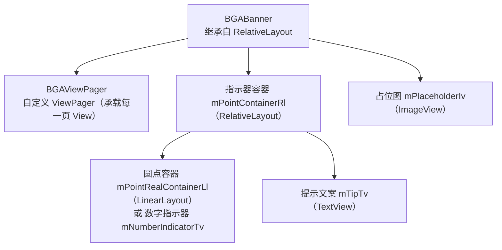

- **`BGAViewPager`**：继承自官方 `ViewPager`，包了自动播放回调、是否允许手指滑动、自定义切换时长等能力。
- **指示器容器 `mPointContainerRl`**：放在 banner 顶部或底部，里面装"小圆点（或数字）"和"提示文案"。
- **占位图 `mPlaceholderIv`**：网络图片还没加载好时，先盖一层占位图。

关键类之间的关系如下：

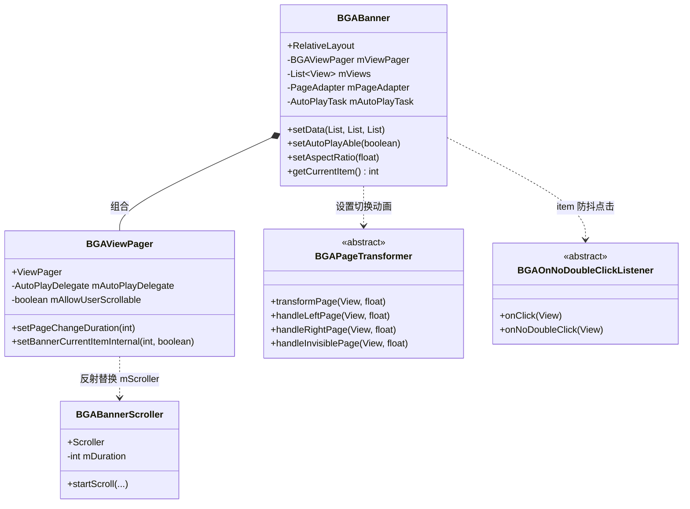

> **设计思想（重点）**：它选择"继承 `RelativeLayout` + 内部组合 `ViewPager`"，而不是"继承 `ViewPager`"。这样做的好处是 banner 区域上方的指示器、文案、占位图都能作为兄弟视图自由摆放，互不干扰。这叫**组合优于继承**——当你要给一个已有控件"加外壳"时，优先考虑在外面套一层容器，而不是去改控件本身。

---

## 三、最小使用示例（便于理解后续原理）

```java
// 1. 在布局里放 BGABanner
// <cn.bingoogolapple.bgabanner.BGABanner
//     android:id="@+id/banner"
//     android:layout_width="match_parent"
//     android:layout_height="180dp" />

// 2. 代码里塞数据
List<String> tips = Arrays.asList("提示一", "提示二", "提示三");
banner.setAdapter(new BGABanner.Adapter<ImageView, String>() {
    @Override
    public void fillBannerItem(BGABanner banner, ImageView itemView, String model, int position) {
        // 这里用 Glide 等加载网络图片到 itemView
    }
});
banner.setData(Arrays.asList("url1", "url2", "url3"), tips);
```

`setData` 是这个组件所有能力的入口，下面先看它的流程。

---

## 四、核心原理剖析

### 4.1 数据设置流程 `setData`

`BGABanner` 提供了多个重载的 `setData`，但最终都收敛到 `setData(List<View> views, List models, List<String> tips)`：

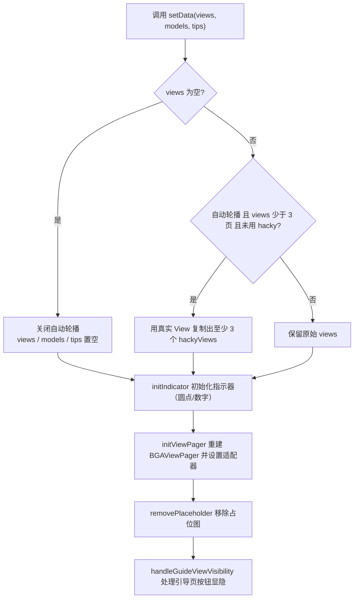

这里有两个细节值得记住：

- **每次 `setData` 都会重建 `BGAViewPager`**（`initViewPager` 里先 `removeView` 旧的再 `new` 一个新的）。这是最简单、最不容易出错的"刷新数据"方式——与其去更新旧 ViewPager，不如整块换掉。
- **`hackyViews` 兜底**：官方 `ViewPager` 在页面数少于 3 时，无限循环动画会出问题。所以当真实页数 < 3 又想自动轮播时，代码把真实 View 复制成至少 3 个（例如 1 页复制成 3 个），用这份复制列表去填充，保证滑动动画正常。这是一个很典型的"用空间换正确性"的兜底技巧。

### 4.2 无限循环轮播原理（重点）

这是整个组件最精妙、也最常被问到的部分。核心思路只有一句话：**让适配器返回一个大到几乎不可能滑到的数量，再把起始位置定位到中间，用"取余数"把任意大位置映射回真实页。**

#### (1) 适配器返回极大值

```java
@Override
public int getCount() {
    return mViews == null ? 0 : (mAutoPlayAble ? Integer.MAX_VALUE : mViews.size());
}
```

当开启自动轮播时，`getCount()` 返回 `Integer.MAX_VALUE`（约 21 亿），相当于"无限多页"。`ViewPager` 本身不关心真实有几页，它只按 position 去要 View。

#### (2) 起始定位到中间

```java
int zeroItem = Integer.MAX_VALUE / 2 - (Integer.MAX_VALUE / 2) % mViews.size();
mViewPager.setCurrentItem(zeroItem);
```

直接把当前页设到「最大值的一半附近、且是 `mViews.size()` 的整数倍」的位置。这样用户向左、向右都有近乎无限的空间可滑，永远滑不到头。

#### (3) 用余数取真实页

无论 `ViewPager` 的 position 多大，真正的页只有 `mViews.size()` 个。所以所有用到"当前是第几页"的地方，都用 `position % mViews.size()` 还原：

```java
// 取 View
View view = mViews.get(position % mViews.size());

// 页面选中回调里更新指示器
position = position % mViews.size();
switchToPoint(position);
```

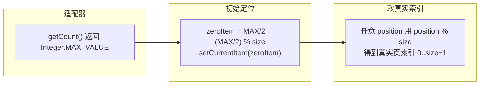

> **为什么不用真的"循环链表"？** 因为 `ViewPager` 的 API 就是"按 position 给 View"的模型，没法直接做成首尾相接的环。用 `Integer.MAX_VALUE` 是成本最低、兼容性最好的"伪无限"方案，业界轮播库（含后来官方的 `ViewPager2` + `RecyclerView` 方案）早期普遍这么干。

### 4.3 自动播放定时调度（Handler + WeakReference）

自动播放的本质：**每隔固定时间，让 `ViewPager` 翻到下一页**。组件用一个 `Runnable` + `postDelayed` 递归实现：

```java
private static class AutoPlayTask implements Runnable {
    private final WeakReference<BGABanner> mBanner;   // 弱引用，防止内存泄漏
    ...
    @Override
    public void run() {
        BGABanner banner = mBanner.get();
        if (banner != null) {
            banner.startAutoPlay();      // 重新安排下一次
            banner.switchToNextPage();   // 翻到下一页
        }
    }
}
```

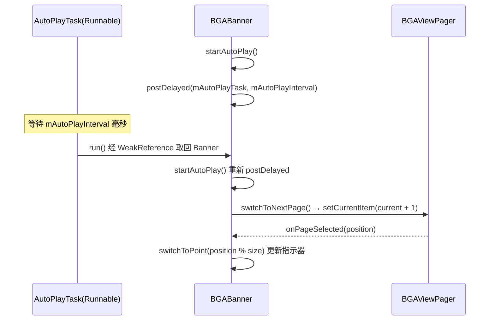

这里有两个关键考点：

- **为什么用 `WeakReference`？** `AutoPlayTask` 被 `postDelayed` 到 View 的消息队列里，会隐式持有 banner。若用强引用，即使页面关闭，banner 也无法被 GC 回收，造成内存泄漏。`WeakReference` 保证 banner 一旦没人用就能被回收，回收后 `mBanner.get()` 返回 `null`，`run()` 直接跳过，安全退出。
- **暂停与恢复**：手指按下时 `stopAutoPlay()`（移除未执行的 `Runnable`），抬起时 `startAutoPlay()`（重新 `postDelayed`），见 4.7 的触摸交互。

### 4.4 反射黑科技：自定义切换时长 & 私有方法调用

`ViewPager` 切换页面时的滑动时长写死在内部 `mScroller` 里，没有公开 setter。组件用**反射**拿到这个私有字段并替换成自定义的 `Scroller`：

```java
public void setPageChangeDuration(int duration) {
    Field scrollerField = ViewPager.class.getDeclaredField("mScroller");
    scrollerField.setAccessible(true);                 // 突破 private
    scrollerField.set(this, new BGABannerScroller(getContext(), duration));
}
```

自定义的 `BGABannerScroller` 只是把 `startScroll` 的时长固定成我们想要的值：

```java
public void startScroll(int startX, int startY, int dx, int dy, int duration) {
    super.startScroll(startX, startY, dx, dy, mDuration);   // 忽略外部传入 duration
}
```

另外，自动轮播时"手指抬起要做吸附到最近页"用到了反射调用 `ViewPager` 的私有方法 `setCurrentItemInternal`：

```java
Method m = ViewPager.class.getDeclaredMethod("setCurrentItemInternal", int.class, boolean.class, boolean.class);
m.setAccessible(true);
m.invoke(this, position, smoothScroll, true);
```

> **原理要点（重点）**：系统类（如 `ViewPager`）很多能力是 private 的，官方没给 API。当你确实需要改它时，**反射能突破私有访问限制**。但它有代价：① 不同 Android 版本字段/方法名可能变化，要 `try-catch` 兜底；② 未来系统升级可能失效。所以反射是"不得已而为之"的手段，能用公开 API 就别用反射。本项目对反射都做了 `try-catch`，失败时静默降级（走默认行为）。
>
> 顺便提一下：项目里还用反射读取 `ViewPager` 私有的 `mVelocityTracker / mActivePointerId / mMaximumVelocity` 来计算手指抬起时的 X 方向速度，从而判断用户是想"翻到下一页"还是"留在当前页"。

### 4.5 PageTransformer 切换动画与 position 模型（重点）

`ViewPager` 提供了一个扩展点 `PageTransformer`，在**每一帧滚动**时回调：

```java
void transformPage(View page, float position);
```

`position` 的含义是理解所有动画的关键：

- 当前正在显示的页，`position == 0`；
- 它左边的页 `position < 0`，右边的页 `position > 0`；
- 完全进入视野的范围是 `[-1, 1]`，超出这个范围就是已经滑出屏幕、看不见的页。

组件把 `position` 分成四个区间，交给子类分别处理：

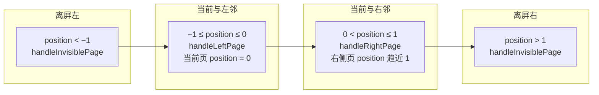

抽象基类 `BGAPageTransformer` 负责分派，具体效果（13 种：Alpha、Rotate、Cube、Flip、Accordion、Depth……）各自实现三个方法。例如 `DepthPageTransformer` 让右侧页随 `position` 从 0→1 逐渐变透明、向左平移、缩小：

```java
public void handleRightPage(View view, float position) {
    ViewCompat.setAlpha(view, 1 - position);
    ViewCompat.setTranslationX(view, -view.getWidth() * position);
    float scale = mMinScale + (1 - mMinScale) * (1 - position);
    ViewCompat.setScaleX(view, scale);
    ViewCompat.setScaleY(view, scale);
}
```

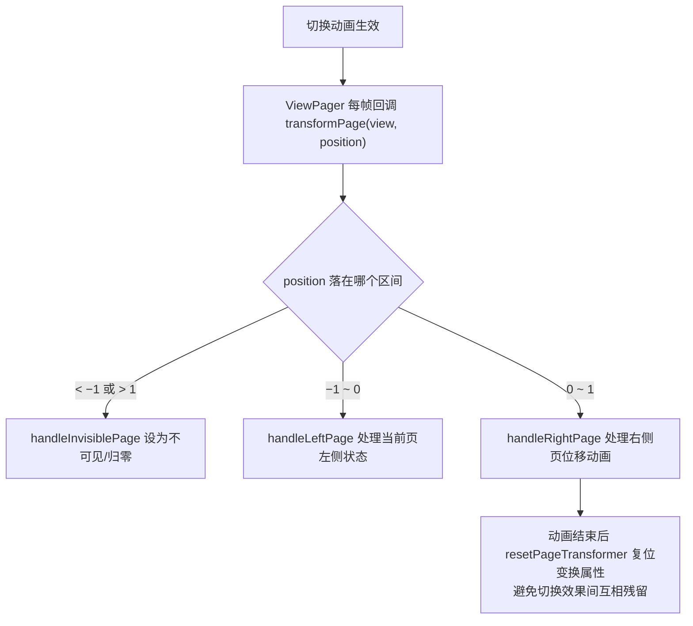

> **原理要点（重点）**：`PageTransformer` 的本质是"**用滚动进度 position 驱动属性动画**"。你不需要自己算时间、自己起动画，只要在 `position` 变化时把 View 的 `translation / scale / alpha / rotation` 设成 position 的函数即可。`ViewCompat.setXxx` 是为了兼容低版本。这也是自定义 View 动画时通用的思路：**把"进度 0~1"映射到"属性值"**。

### 4.6 指示器与提示文案

指示器有两种形态，在 `initView` 时二选一：

- **圆点模式**：`mPointRealContainerLl`（一个横向 `LinearLayout`），`initIndicator` 里给每个真实页 `new` 一个 `ImageView` 放进去；`switchToPoint(position)` 时遍历圆点，给当前页的 `ImageView` 调 `setSelected(true)`，靠 selector 背景（`bga_banner_selector_point_solid.xml`）切换实心/空心。
- **数字模式**：一个 `TextView` 显示 `"当前页+1 / 总页数"`。

提示文案 `mTipTv` 更有意思：在 `onPageScrolled` 里，根据 `positionOffset`（0~1 的滚动进度）做**淡入淡出 + 文字切换**，让文案随页面滚动平滑过渡，而不是硬切：

```java
if (positionOffset > 0.5f) {
    mTipTv.setText(mTips.get(rightPosition));
    ViewCompat.setAlpha(mTipTv, positionOffset);
} else {
    ViewCompat.setAlpha(mTipTv, 1 - positionOffset);
    mTipTv.setText(mTips.get(leftPosition));
}
```

指示器的位置（上/下、左/右、水平居中）由自定义属性 `banner_indicatorGravity` 控制，在 `initView` 里转成 `RelativeLayout` 的布局规则。

### 4.7 触摸事件与自动播放的交互

`BGABanner` 重写了 `dispatchTouchEvent`，在手指按下时暂停轮播、抬起/取消时恢复：

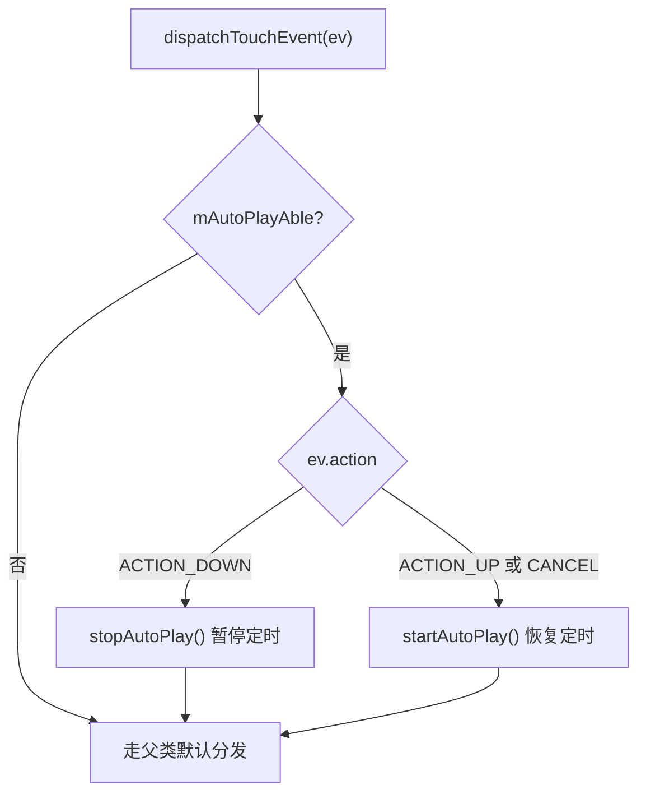

而 `BGAViewPager` 重写了 `onTouchEvent`：在手指抬起/取消时，把计算出的 X 方向速度交给 `AutoPlayDelegate.handleAutoPlayActionUpOrCancel(xVelocity)`。在 `BGABanner` 的实现里，根据这个速度和 `mPageScrollPositionOffset`（滑动进度）判断"吸附到上一页还是下一页"，再反射调用 `setCurrentItemInternal` 立即跳过去。这是为了让自动轮播和手动滑动在体验上衔接自然。

> **原理延伸**：`dispatchTouchEvent`（分发）→ `onInterceptTouchEvent`（父控件是否拦截）→ `onTouchEvent`（消费）是 Android 触摸事件三阶段。本项目在 `BGAViewPager` 里重写 `onInterceptTouchEvent` 来控制"是否允许手指滑动"（`mAllowUserScrollable` 为 false 时直接不分发，用于纯自动轮播场景）。理解这套分发机制，是处理一切滑动冲突的基础。

### 4.8 引导页的"跳过 / 进入"按钮联动

引导页（首次启动介绍）通常最后一页才显示"进入"按钮，前面页显示"跳过"按钮。`BGABanner` 让按钮定义在 Activity 布局里，通过 `setEnterSkipViewId` / `setEnterSkipViewIdAndDelegate` 用 `findViewById` 拿到，然后在翻页时根据位置淡入淡出：

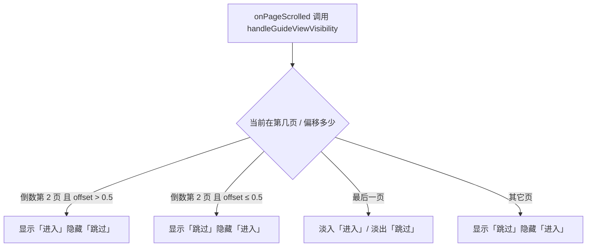

按钮点击用 `BGAOnNoDoubleClickListener` 包了一层（见 4.11），避免快速连点触发多次逻辑。

另外还有一个配套控件 `BGAGuideLinkageLayout`：它继承 `FrameLayout`，重写了 `dispatchTouchEvent`，**把每一次触摸事件都派发给所有子 View**，而不是只给最上层的那个。这样引导页里多个图层（背景、前景元素）能同时响应同一个手势，实现"联动"效果。

### 4.9 占位图与网络图片

网络图片需要异步加载，加载完成前先盖一张占位图：

- `showPlaceholder()`：在 `initView` 阶段创建 `mPlaceholderIv` 并盖在最上层；
- 调用 `setData` 设置真实数据后 `removePlaceholder()` 把占位图移除；
- 真实图片由开发者在 `Adapter.fillBannerItem` 里用 Glide/Picasso 等加载到对应的 `ImageView`。

组件本身不耦合任何图片加载库，只负责"占位图的显隐时机"，这是良好的**依赖解耦**设计。

### 4.10 Bitmap 内存优化（采样、RGB_565、OOM 兜底）

本地图片（`setData(resIds...)`）由 `BGABannerUtil.getScaledImageFromResource` 加载。直接 `BitmapFactory.decodeResource` 大图极易 OOM，这里用标准采样压缩：

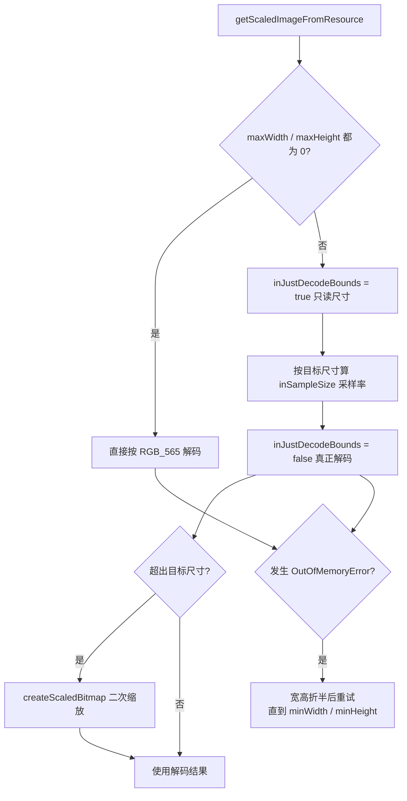

要点：

- **`inJustDecodeBounds = true`**：第一次解码只读取图片宽高，不产生 Bitmap；
- **`inSampleSize`**：取 2 的幂次，把图片缩小到目标尺寸的邻近值（如 2 表示宽高各减半，内存降为 1/4）；
- **`Bitmap.Config.RGB_565`**：一个像素占 2 字节（相比 `ARGB_8888` 的 4 字节省一半内存），banner 图不需要透明度时用它；
- **OOM 兜底**：万一还是内存溢出，把目标宽高折半重试，直到低于下限，最大程度保证不崩溃。

> **原理要点（重点）**：这是 Android 图片加载的通用范式——**先探尺寸、再算采样率、最后解码**，配合低配 `Bitmap.Config` 和 OOM 重试。你在任何需要加载本地大图的场景（相册、头像、背景图）都能直接套用。

### 4.11 点击防抖

列表/轮播的 item 点击经常被快速连点。`BGAOnNoDoubleClickListener` 是个抽象类，包装了 `View.OnClickListener`，内部用时间戳限制"默认 1 秒内只响应一次"：

```java
public void onClick(View v) {
    long currentTime = System.currentTimeMillis();
    if (currentTime - mLastClickTime > mThrottleFirstTime) {
        mLastClickTime = currentTime;
        onNoDoubleClick(v);   // 子类只实现这个
    }
}
```

这是"**节流（throttle）**"思想的典型实现：固定时间窗口内只放行第一次事件。在按钮防重复提交、防止重复跳转等场景通用。

### 4.12 宽高比 `onMeasure` 与生命周期感知

- **宽高比**：设置了 `banner_aspectRatio` 后，`onMeasure` 里根据测量出的宽度反推高度 `height = width / aspectRatio`，再用 `MeasureSpec.EXACTLY` 锁定。这样不用硬编码 `layout_height`，banner 能随屏幕宽度自适应。
- **生命周期/可见性管理**（避免后台空转和 RecyclerView 卡顿）：

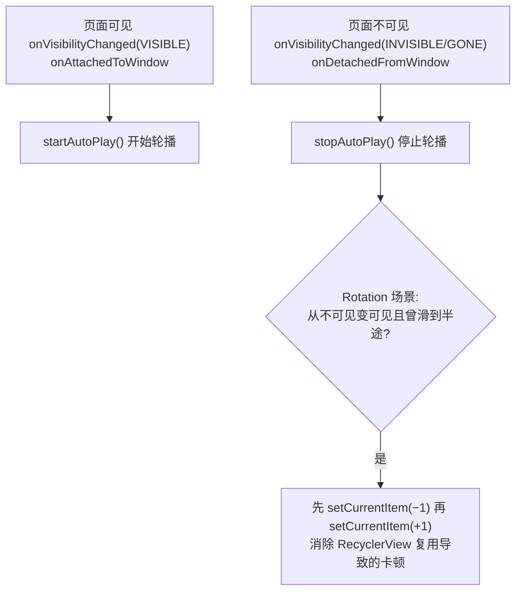

要点：

- 组件在 `onAttachedToWindow` / `onVisibilityChanged(VISIBLE)` 时启动轮播，在 `onDetachedFromWindow` / 不可见时停止。这样页面切到后台、滑出屏幕就不会白白耗电和占主线程。
- 针对"banner 放在 `RecyclerView` 里，从不可见变回可见时画面卡住"的问题，代码做了一个小修复：若之前停在半页（`mPageScrollPositionOffset != 0`），先退一格再进一格，强制 `ViewPager` 重新布局，消除卡顿。

> **原理要点（重点）**：自定义控件一定要有**生命周期/可见性意识**。任何"定时任务、动画、监听"都要在不可见时停止、可见时恢复，否则会内存浪费、耗电、甚至崩溃。这是写自定义 View 的基本功。

---

## 五、关键设计思想总结（举一反三）

把上面所有点抽象成几条可迁移的设计原则：

1. **组合优于继承**：给控件加外壳，优先在外面套容器，别去改控件本身。
2. **用"极大值 + 取余"模拟无限**：无限轮播、无限列表这类需求，不一定非要真环形结构，`Integer.MAX_VALUE` + `position % size` 是低成本解法。
3. **反射是双刃剑**：能改系统私有行为，但脆弱、需兜底；优先用公开 API。
4. **进度驱动动画**：把"0~1 的滚动进度"映射成"View 的变换属性"，是做切换动画的通用套路（不只 `ViewPager`，`RecyclerView`、`ViewPager2`、`MotionLayout` 同理）。
5. **生命周期感知**：定时/动画/监听都要随可见性启停。
6. **内存安全**：用 `WeakReference` 打破定时任务对页面的强引用；图片加载先采样、低配 `Config`、OOM 重试。
7. **解耦第三方库**：组件不内置图片加载框架，只暴露 `Adapter` 让开发者自己填，避免强依赖。
8. **兜底思维**：少于 3 页时用 `hackyViews` 复制、反射失败静默降级、`isCollectionEmpty` 多处判空——健壮组件都替调用方考虑了边界情况。

---

## 六、延伸思考（检验你是否真懂了）

- 如果要换成 `ViewPager2`（基于 `RecyclerView`），无限循环还能用 `Integer.MAX_VALUE` 吗？`RecyclerView` 的 `Adapter` 机制下你会怎么实现？（提示：`RecyclerView` 的 `getItemCount` 同样可返回极大值，`onBindViewHolder` 里用 `position % realSize` 取数据。）
- `PageTransformer` 的 `position` 模型和 `RecyclerView.ItemAnimator` / `ConcatAdapter` 有什么相通之处？
- 为什么 `PageAdapter.getItemPosition` 返回 `POSITION_NONE`（表示所有 item 都变了，需要重绑），而 `destroyItem` 是空实现？这和"极大 count"的设计有什么关系？
- 若把自动播放换成 `Handler` + `sendEmptyMessageDelayed` 而非 `View.postDelayed`，两者在线程和内存上有区别吗？

---

> 文档基于 `library` 模块源码（`BGABanner`、`BGAViewPager`、`BGABannerScroller`、`BGABannerUtil`、`BGAPageTransformer` 及 `transformer` 包）整理。建议结合源码中的注释与本文对照阅读，理解会更扎实。

---

## 附：面试高频考点速记

> 下面把前文"重点"内容压缩成可秒记的口诀和自测问答。先背口诀建立框架，再用问答查漏补缺。

### 速记口诀

| 主题 | 口诀 | 对应原理 |
| --- | --- | --- |
| 无限轮播 | **极大定位、取余还原** | `getCount()` 返回 `Integer.MAX_VALUE`，起始 `setCurrentItem(MAX/2 − MAX/2%size)`，全程 `position % size` 取真实页 |
| 自动播放 | **延迟递归、弱引用兜底** | `postDelayed` 递归调度 `AutoPlayTask`，`WeakReference` 防 banner 内存泄漏 |
| 切换时长 | **反射换 Scroller** | 反射替换 `ViewPager` 私有 `mScroller` 为自定义 `BGABannerScroller`，固定 `duration` |
| 切换动画 | **进度映射、属性变换** | `PageTransformer.transformPage` 的 `position∈[-1,1]` 驱动 `translation/scale/alpha/rotation` |
| 手势吸附 | **反射调内部、速度定方向** | 反射 `setCurrentItemInternal` + 反射读 `mVelocityTracker` 算 X 速度决定翻哪页 |
| 图片加载 | **探尺寸、算采样、低配重试** | `inJustDecodeBounds` 探尺寸 → `inSampleSize` 采样 → `RGB_565` → OOM 折半重试 |
| 生命周期 | **可见启动、不可见停** | `onAttachedToWindow`/`onVisibilityChanged(VISIBLE)` 启动，不可见/`onDetachedFromWindow` 停止 |
| 点击防抖 | **时间戳、节流放行** | `BGAOnNoDoubleClickListener` 用 `currentTime − lastClick > 阈值` 实现 1 秒节流 |
| 引导联动 | **事件全派发** | `BGAGuideLinkageLayout.dispatchTouchEvent` 把触摸事件派发给所有子 View |
| 健壮性 | **组合优先、兜底思维** | `<3 页` 用 `hackyViews` 复制、反射 `try-catch` 降级、多处 `isCollectionEmpty` 判空 |

> 一句话总纲：**套容器组合、用极大数模拟无限、靠反射突破私有、以进度驱动动画、随可见性管生命周期。**

### 高频问答（自测）

> 合上文档，先自己口述一遍，再对照要点查缺。括号里是对应章节。

1. **为什么 `ViewPager` 能"无限"往右滑？** （4.2）
   要点：`getCount()` 返回 `Integer.MAX_VALUE`，起始定位到中间，所有取页/取索引都用 `position % 真实页数` 还原。本质是"伪无限"，不是真环形结构。

2. **自动播放为什么用 `WeakReference` 包 `BGABanner`？** （4.3）
   要点：`Runnable` 被 `postDelayed` 进消息队列会隐式持有外部类；强引用会让 banner 在页面关闭后无法被 GC，造成内存泄漏。`WeakReference` 在对象无人引用时自动释放，`get()` 为 `null` 就安全跳过。

3. **怎么自定义 `ViewPager` 的页面切换时长？** （4.4）
   要点：切换时长写死在 `ViewPager` 内部 `mScroller` 里没有公开 setter，用反射拿到该私有字段并 `setAccessible(true)`，替换成自定义 `Scroller`（`startScroll` 强制使用指定 `duration`）。注意要 `try-catch` 兜底兼容不同版本。

4. **`PageTransformer.transformPage(view, position)` 里 `position` 到底是什么意思？** （4.5）
   要点：当前页 `position=0`，左邻 `<0`、右邻 `>0`；可见范围 `[-1,1]`，超出即离屏。把 `position` 当作"滚动进度"，将其映射成 View 的变换属性即可实现各种切换动画。

5. **`setData` 为什么要重建 `BGAViewPager`？少于 3 页为什么要搞 `hackyViews`？** （4.1）
   要点：整块重建是成本最低、最不易出错的"刷新数据"方式。`ViewPager` 页数 `<3` 时无限循环动画会异常，于是把真实 View 复制成至少 3 个来保证滑动正常。

6. **图片加载如何避免 OOM？** （4.10）
   要点：先 `inJustDecodeBounds=true` 只读尺寸不占内存；按目标尺寸算 2 的幂次 `inSampleSize`；用 `RGB_565` 省一半内存；仍 OOM 则把目标宽高折半重试直到下限。

7. **自定义控件为什么要关心生命周期/可见性？** （4.12）
   要点：定时任务、动画、监听若不随可见性启停，会在后台空转、耗电、占主线程，甚至因持有旧页面导致泄漏或卡顿。组件在 `onAttachedToWindow`/可见时启动、不可见/`onDetachedFromWindow` 时停止。

8. **`dispatchTouchEvent`、`onInterceptTouchEvent`、`onTouchEvent` 三者是什么关系？** （4.7）
   要点：分发三阶段——父容器 `dispatchTouchEvent` 决定是否下发，`onInterceptTouchEvent` 决定是否拦截给自己，`onTouchEvent` 决定是否消费。本项目借此控制"是否允许手指滑动"和"按下暂停轮播、抬起恢复"。

9. **为什么 `PageAdapter.getItemPosition` 返回 `POSITION_NONE` 而 `destroyItem` 是空实现？** （4.1/4.2）
   要点：因为 `count` 是极大值，ViewPager 不会真的销毁/重建 item，视图复用由我们自己（先 `removeView` 再 `addView`）管理；返回 `POSITION_NONE` 让数据刷新时强制重绑，空 `destroyItem` 避免误销毁被极大 count 引用的视图。

10. **这个组件体现了哪些可迁移的设计原则？** （五）
    要点：组合优于继承、极大+取余模拟无限、反射双刃剑需兜底、进度驱动动画、生命周期感知、内存安全（`WeakReference`/采样）、解耦第三方库、边界兜底思维。
